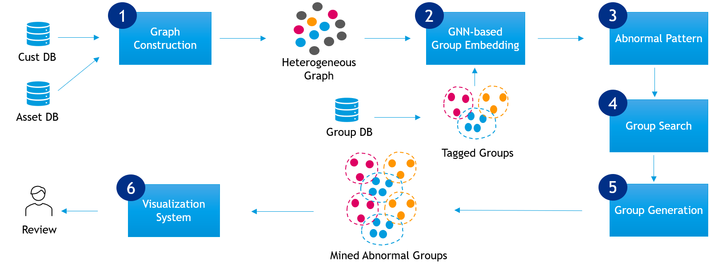
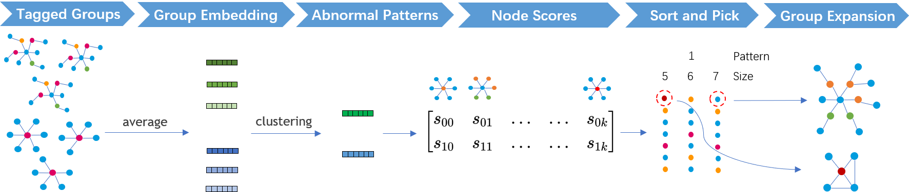
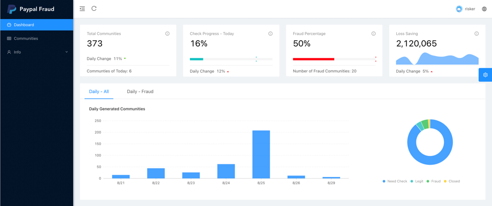
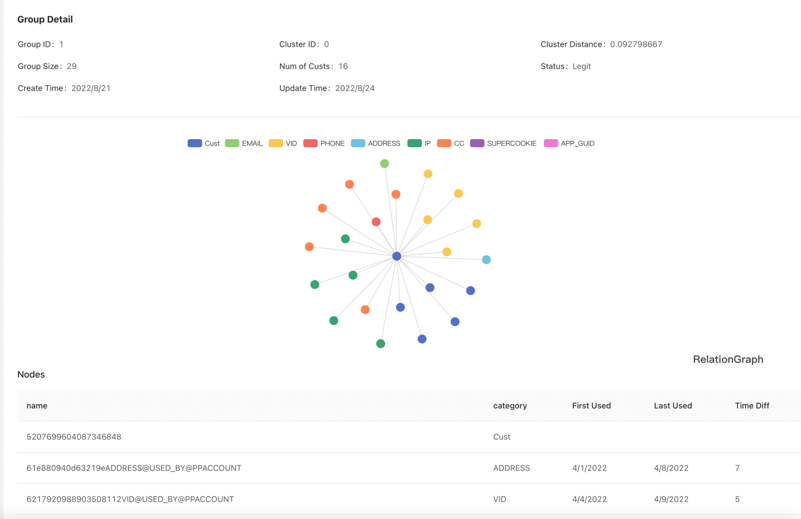

# SEAP

This is the PyTorch implementation of "SEAP: SEMI-SUPERVISED ABNORMAL GROUP MINING ON LARGE-SCALE HETEROGENEOUS GRAPHS".



The pipeline of mining abnormal groups:


# Usage

- ```U-HGAT/```: includes all codes for U-HGAT, a unsupervised heterogeneous graph attention network.
  - ```train.py```: The code for training U-HGAT to learn node embeddings.
  - ```model.py```: The code of U-HGAT model.
  - ```conv.py```: The code of convolution layer in U-HGAT.
  - ```negative_sampler.py```: The code of generating negative samples for unsupervised learning.
- ```model.ipynb```: includes all codes for SEAP.
  - Load data.
  - Heterogeneous Graph Construction.
  - Clustering for Abnormal Patterns.
  - Abnomral Group Search and Generation.


# Model Training

```python
# Train U-HGAT to generate node embeddings for heterogeneous graphs.
cd U-HGAT/
python train.py

# Run codes in model.ipynb to mine abnormal groups.
open model.ipynb
```

# Results

Performance of methods:

| Method            | Abnormal Group Rate% |
| ----------------- | -------------------- |
| Random            | 0%                   |
| Random with 1-hop | 29%                  |
| Current Baseline  | 70%                  |
| **SEAP**          | **89%**              |

Statistical information of mined groups:

| Group Type         | \#Groups | \#Abnormal Groups | Abnormal Group Rate% |
| ------------------ | -------- | ----------------- | -------------------- |
| Account-centered   | 216      | 195               | 90.3%                |
| Attribute-centered | 244      | 216               | 88.5%                |
| Total              | 460      | 411               | 89.3%                |

# Visualization System

The interface of the dashboard in the system:



The interface of group detail in the system:


